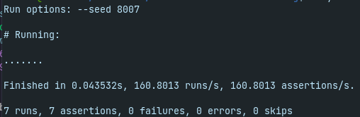

# Customer Success Balacing Challenge
Este desafio consiste em um sistema de balanceamento entre clientes e Customer Success (CSs). Os CSs são os Gerentes de Sucesso, são responsáveis pelo acompanhamento estratégico dos clientes.

Dependendo do tamanho do cliente - aqui nos referimos ao tamanho da empresa - nós temos que colocar CSs mais experientes para atendê-los.

Um CS pode atender mais de um cliente e além disso os CSs também podem sair de férias, tirar folga, ou mesmo ficarem doentes. É preciso levar esses critérios em conta na hora de rodar a distribuição.

Dado este cenário, o sistema distribui os clientes com os CSs de capacidade de atendimento mais próxima (maior) ao tamanho do cliente.


# Ambiente
- Versão executada: ruby 2.7.0p0
- Ambiente: x86_64-linux-gnu


## Executar os testes localmente

No terminal, execute os comandos:

```
cd src/
ruby customer_success_balancing.rb
```

## Análise do algoritmo
Utilizando-se da análise assintótica, a complexidade do algoritmo é `N Log N` (sub-linear).
Para a memória, pode ser considerado O(n) - linear. Para isso, não é considerado o tamanho da entrada; mas sim atribuições e operações booleanas.

### Resultados locais


---

## Mais informações
Algoritmo desenvolvido por [Cauane Andrade](https://www.linkedin.com/in/cauaneandrade/).

* [github.com/CauaneAndrade](https://github.com/CauaneAndrade/)
* [linkedin.com/in/CauaneAndrade](https://www.linkedin.com/in/CauaneAndrade/)
